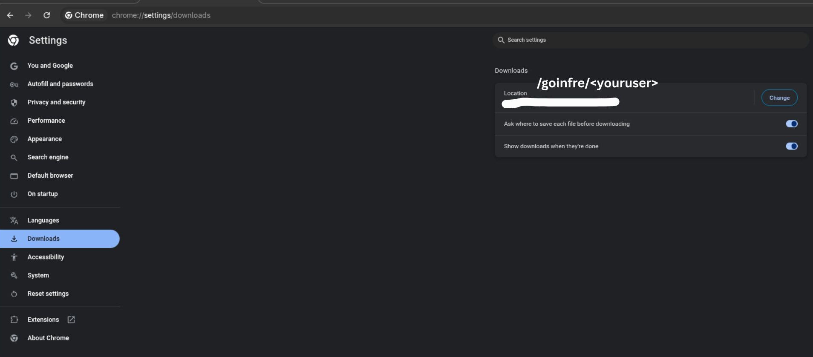

# 🐉 Kali Linux on VirtualBox — VDI Quick Setup Guide

> **For 42 Network / school lab machines** where your home directory has a limited disk quota.  
> This guide uses the pre-built VDI image so **no installation is required** — just download, extract, and run.

---

## 📋 Table of Contents

1. [Change Browser Download Location to goinfre](#step-1--change-browser-download-location-to-goinfre)
2. [Download the Kali VDI](#step-2--download-the-kali-vdi)
3. [Extract the Archive](#step-3--extract-the-archive)
4. [Open the VM in VirtualBox](#step-4--open-the-vm-in-virtualbox)
5. [Start the VM](#step-5--start-the-vm)
6. [Default Credentials](#-default-credentials)

---

## Step 1 — Change Browser Download Location to goinfre

> **Why?** Your home directory (`~`) on 42 / school machines typically has a very small quota (a few GB).  
> `/goinfre/<youruser>` is a large **local scratch space** on the machine — the right place for a ~4 GB download.

### 🦊 Firefox

1. Open Firefox → click the **☰** menu → **Settings**
2. Scroll down to **Files and Applications**
3. Under **Downloads**, click **Browse…** next to *Save files to*
4. Navigate to `/goinfre/<youruser>` and click **Select Folder**

### 🌐 Chrome / Chromium

1. Open Chrome → click **⋮** → **Settings**
2. Click **Downloads** in the left sidebar
3. Next to **Location**, click **Change**
4. Navigate to `/goinfre/<youruser>` and click **Select**



---

## Step 2 — Download the Kali VDI

1. Go to 👉 [https://www.kali.org/get-kali/#kali-virtual-machines](https://www.kali.org/get-kali/#kali-virtual-machines)
2. Select **VirtualBox** as your platform
3. Click the download button — the `.7z` archive (e.g. `kali-linux-2026.x-virtualbox-amd64.7z`) will be saved to `/goinfre/<youruser>`

---

## Step 3 — Extract the Archive

You can extract in two ways:

**Option A — File Manager (easiest):**  
Simply double-click the `.7z` file in your file manager to extract it.

**Option B — Terminal:**
```bash
cd /goinfre/<youruser>
7z x kali-linux-*.7z
```

After extraction you will see a folder containing these files:


| File | Description |
|------|-------------|
| `kali-linux-*.vdi` | Virtual disk image (the main disk) |
| `kali-linux-*.vbox` | VirtualBox machine config — **open this to add the VM** |
| `Logs/` | VirtualBox runtime logs |

---

## Step 4 — Open the VM in VirtualBox

**Double-click** the `.vbox` file in the extracted folder.  
This automatically registers and opens the machine in VirtualBox Manager — no manual setup needed.

> 💡 Alternatively, in VirtualBox go to **Machine → Add…** and select the `.vbox` file.

---

## Step 5 — Start the VM

1. Select **kali-linux-…** in the VirtualBox Manager sidebar
2. Click **▶ Start**
3. Kali Linux boots directly — **no installation required**

---

## 🔑 Default Credentials

| Username | Password |
|----------|----------|
| `kali`   | `kali`   |

> ⚠️ Change the default password after first login for security.

---

## 💡 Tips

- The `/goinfre` folder is **local to the machine** — if you switch computers, you'll need to re-download.
- To save disk space after setup, you can delete the original `.7z` archive.
- Kali Linux comes with hundreds of pre-installed security tools out of the box.

